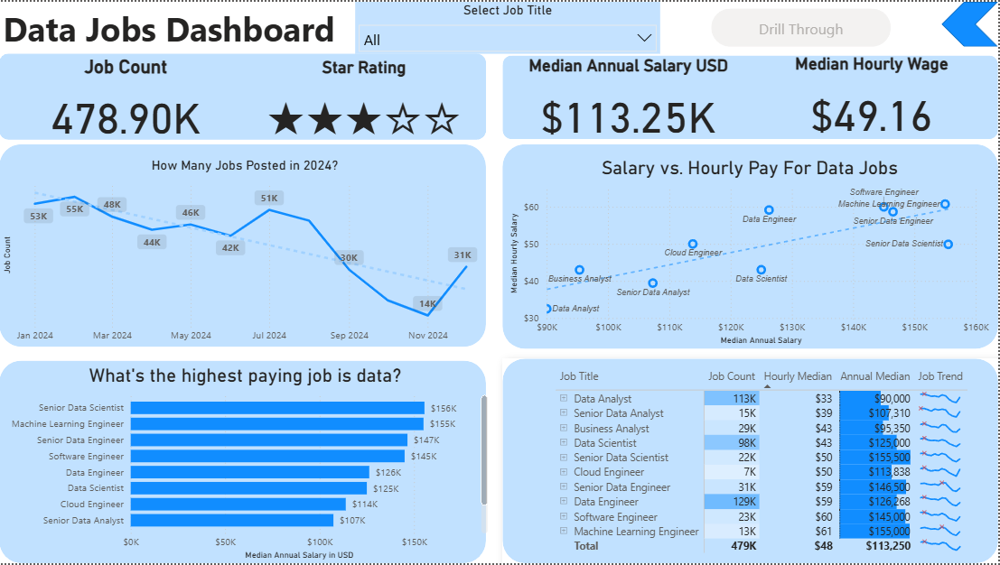
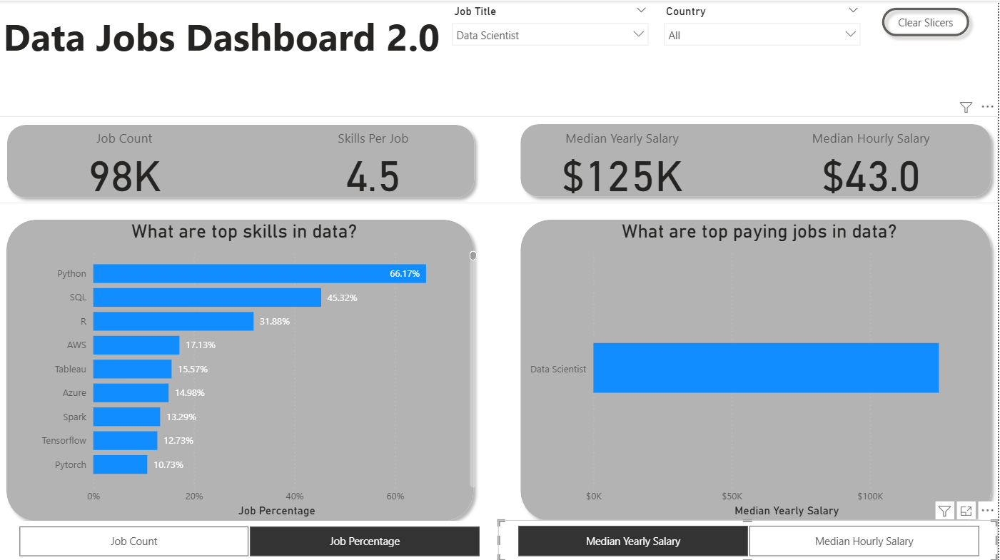

# 📊 Data Jobs Market Analysis (Power BI)

This repository contains an analysis of the **2024 Data Jobs Market** using Power BI.  
The project demonstrates how dashboards evolve from a **basic overview** to an **enhanced, role-focused analytical tool**.  

---

## 📂 Repository Structure
- `README.md` → Overview of the project  
- `README-basic.md` → Details for the **Initial Dashboard** (general insights)  
- `README-enhanced.md` → Details for the **Enhanced Dashboard** (role-focused insights)  
- `/images/` → Screenshots of dashboards  

---

## 🎯 Objective
- Analyze the **2024 Data Jobs Market dataset** from [Luke Barousse’s DataNerd.tech](https://datanerd.tech).  
- Compare two dashboards:
  1. **Initial Dashboard** → General insights (job counts, salaries, top roles)  
  2. **Enhanced Dashboard** → Role-level insights (salary, job benefits, geography, platforms)  

---

## 📊 Dashboards
### 🔹 1. Initial Dashboard

### 🔹 2. Enhanced Dashboard

---

## 🛠 Tools & Tech
- **Power BI** → Visualization & dashboarding  
- **DAX** → Custom measures  
- **Power Query** → Data preparation  

---

## 🚀 Key Takeaways
- Initial dashboards provide **broad insights**, but may lack actionable depth.  
- Enhanced dashboards allow **role-specific analysis**, which is more valuable to recruiters, analysts, and job seekers.  

---

